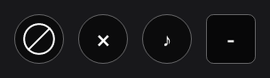
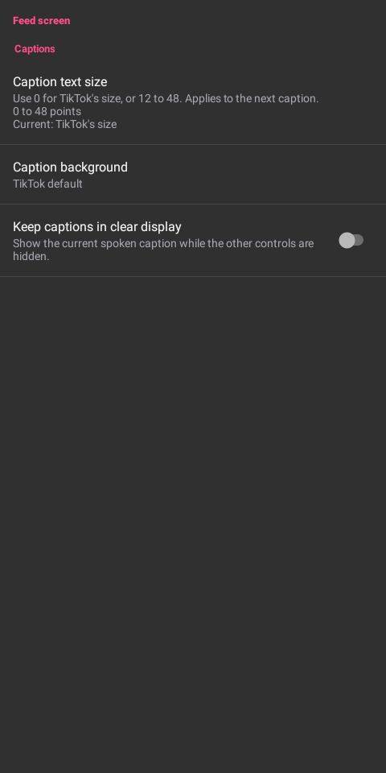
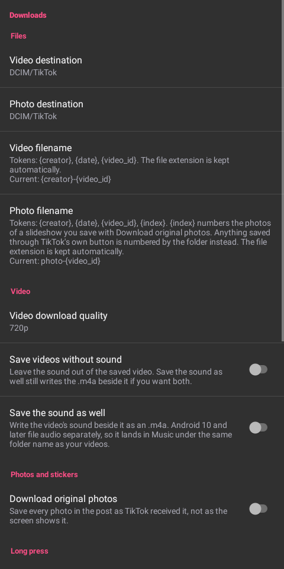
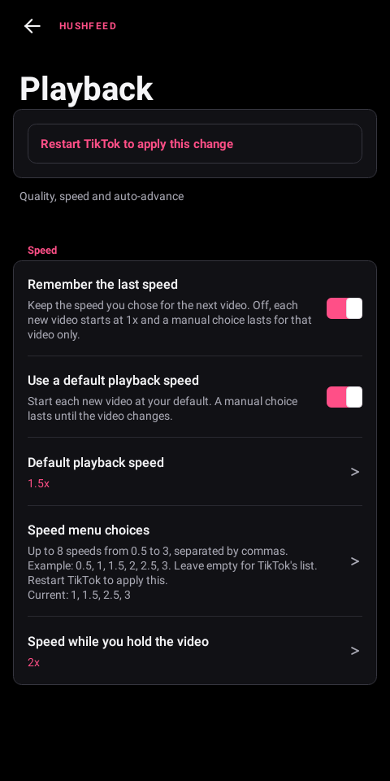
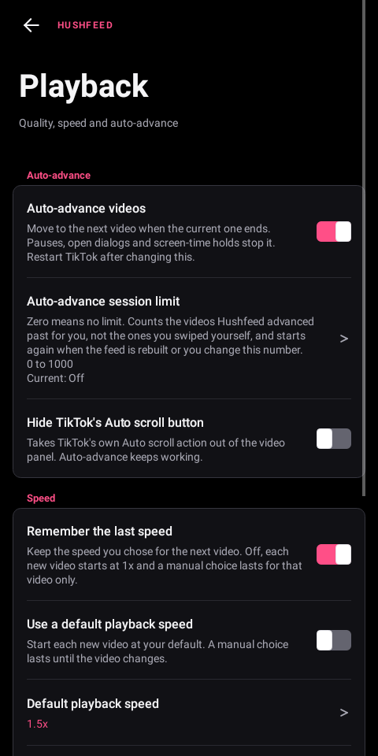
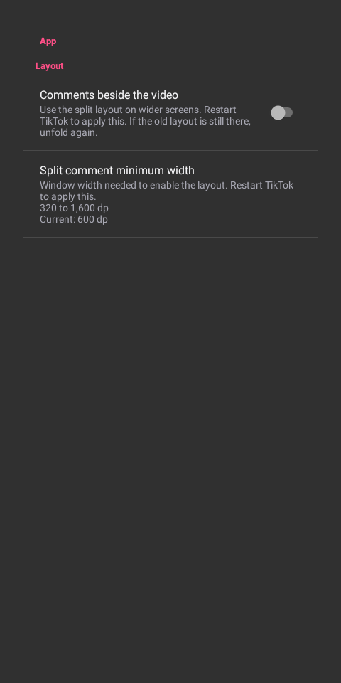
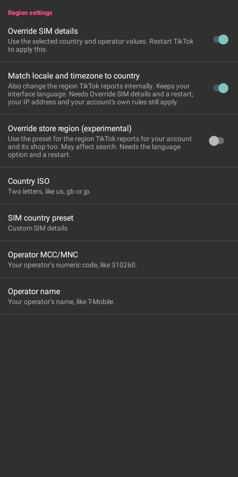
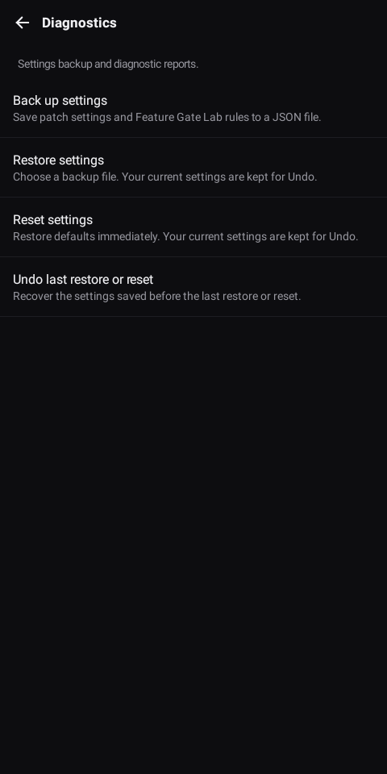
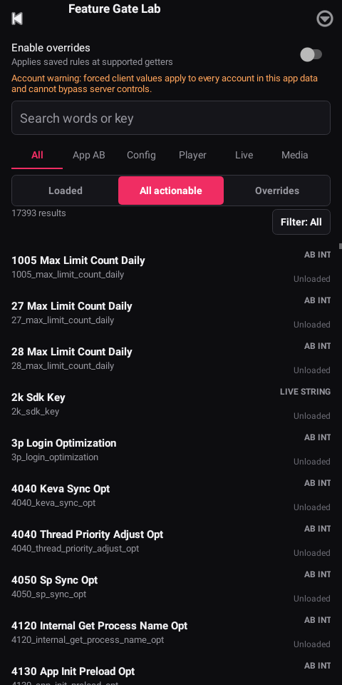

<p align="center">
  
</p>

<p align="center">
  <a href="LICENSE"></a>
  <a href="CHANGELOG.md"></a>
  <a href="https://github.com/MorpheApp/morphe-cli"></a>
  <a href="https://www.android.com/"></a>
  <a href="https://www.apkmirror.com/apk/tiktok-pte-ltd/tik-tok-including-musical-ly/tiktok-46-2-3-release/tiktok-46-2-3-android-apk-download/"></a>
</p>

# Metra TikTok Patches

## This fork

This is a private working copy of [icysymmetra/tiktok-patches-for-morphe](https://github.com/icysymmetra/tiktok-patches-for-morphe) with a few patches of my own on top. It builds the same bundle, so everything upstream ships is still here. What's added:

- `Block author button`: one tap blocks whoever posted the current video, with an undo banner. Long press the button to move it. A second button blocks the current sound.
- `Hide inbox items`: a switch for every row and header control on the Inbox tab, plus a Clear all control for suggested accounts. System categories follow TikTok's row data, so their switches work in every language and leave conversations with the same title alone.
- `Comment tools`: hide comments by keyword or by account, and block a commenter with the thumbs down on their comment.
- `Hide video overlays`: switches for the "Search this image" prompt and the top left Live entrance.
- `Share sheet tools`: a second tap is needed before a video goes to a friend, and people or share options can be hidden by name, or the whole Send to row.
- Feed filters include blocked caption phrases and creator handles, maximum video length, promotional music, LIVE replays and views per like. The sound blocklist and existing content switches remain available.

Duration and engagement limits keep the closest eligible video if they would empty a page. Creator blocks, blocked words and other content filters always win, so a page containing only blocked content stays empty.

The block, sound and Not interested controls (rendered in a local UI test):



Select `Subtitle tools` in the patcher, then enable subtitle downloads in Downloads. Captioned videos and their SRT files share the same filename stem. Language names can use Unicode, and filename collisions keep separate tracks. Android 11 and later save the pair in Movies; Android 10 uses Download. The selected subfolder still applies. A failed subtitle transfer leaves the saved video intact and reports the partial result.

Caption appearance and the clear display option are in Interface. These views were rendered in local UI tests:

 

Releases are built and versioned by hand here; the upstream release workflow isn't used. The bundle lands in `patches/build/libs/`.

<br>

**This repository is a Morphe patch source for TikTok.**

**It continues the work from earlier community TikTok patch sets, including ReVanced, with the patches adapted for Morphe and tested against newer TikTok builds. The current target is the global TikTok package, `com.zhiliaoapp.musically`, on [TikTok `46.2.3`](https://www.apkmirror.com/apk/tiktok-pte-ltd/tik-tok-including-musical-ly/tiktok-46-2-3-release/tiktok-46-2-3-android-apk-download/).**

The goal is to keep the existing patch set usable while adding more TikTok-focused features over time. Some features are small fixes, some are quality-of-life changes, and some need deeper testing because TikTok changes its internals often.

<br>

## Available Patches

| Patch | Description |
|---|---|
| `Automatic video advance` | Keeps native automatic advance enabled. TikTok still checks pauses, dialogs, gestures and whether another video is available. Turn it off in Playback to stop advance started by this option. |
| `Foldable split comment view` | Enables comments beside the video from a configurable window width (600 dp by default). Off by default, with multi-window and picture-in-picture restrictions preserved. Restart after changing its settings or unfolding if TikTok keeps the old layout. |
| `Subtitle tools` | Saves captions as SRT files beside downloaded videos. Choose original, device or all available languages, adjust caption size and background, and keep the current caption visible in clear display. |
| `Playback quality` | Chooses the lowest, highest or a target video quality for regular and adaptive playback. Download quality has its own setting. |
| `Advanced downloads` | Selects a video quality or target resolution and combines separate audio tracks when needed. An optional Photo Mode downloader saves source images directly, preserving their bytes and format. |
| `Long-press controls` | Lets a long press on a video keep TikTok's own action, do nothing, or open the video's comments. |
| `Double-tap controls` | Changes feed double taps to do nothing or open comments for the current video. TikTok's normal action is the default. |
| `Confirm feed interactions` | Adds optional second-tap protection to Follow and the like heart. The red ring expires after four seconds and resets when the video changes. |
| `AMOLED dark theme` | Replaces the dark background palette with black or a chosen opaque color. Select the patch and its color in the patcher. Light theme colors stay unchanged. |
| `Always show publish date` | Keeps the video's publish date visible in its author information. |
| `Not interested button` | Sends feedback about the current video through TikTok's own service. The button works independently of the block switch. |
| `Block author button` | Adds a button to the video player that blocks the account that posted the current video in one tap, with an undo banner. Long press it to move it. A second button blocks the current sound. |
| `Comment tools` | Hides comments containing chosen words or from chosen accounts, and turns the thumbs down on each comment into a block button. |
| `Copy comments without username` | Copies only the comment text without including the creator's username. |
| `Custom offline videos limit` | Adds a custom entry to TikTok's offline videos menu with a configurable limit from 1 to 1000 videos. Values outside the range use the nearest valid limit. |
| `Disable login requirement` | Removes TikTok's mandatory login gate from supported flows. |
| `Disable long-press quick share` | Keeps long-pressing Share from opening TikTok's quick-share interaction. |
| `Disable long-press repost` | Keeps holding Like from opening TikTok's repost action without disabling TikTok's wider repost and upvote systems. |
| `Disable screen capture detection` | Prevents TikTok from detecting screenshots and screen recordings. |
| `Allow screenshots and Circle to Search` | Removes secure window flags and the native Circle to Search block. Off by default. Restart after changing the setting. |
| `Diagnostic tools` | Adds optional structured Morphe logs, TikTok crash capture, and clipboard or file report export. |
| `Downloads` | Adds watermark-free downloads, filename templates, and comment sticker saving with animated-media preservation. |
| `Enable Live search` | Shows TikTok's search entry in the Live drawer where supported. |
| `Enable non-personalized search` | Uses TikTok's non-personalized search mode instead of its saved account choice. |
| `Feature Gate Lab` | Adds a searchable menu for viewing and overriding supported TikTok feature flags and configuration values. Client-side overrides cannot bypass server enforcement. |
| `Feature Gate Recorder` | Records gate reads while you use a feature, then shows new and changed values. Save the full report as JSON or copy a smaller report. |
| `Feed filter` | Hides feed ads, TikTok Shop items, livestreams, stories, photo posts, the playlist bar, the floating event badge, inserted cards, the countdown lock on short drama adverts, and videos outside configured view or like ranges, with optional filtering of cached and offline FYP fallback videos. |
| `Feed tab navigation` | Controls which loaded top and bottom navigation tabs remain visible, blocks newly added tabs when requested, and can hide the Tako AI bubble. |
| `Fix Google login` | Restores Google account sign-in after patching. |
| `Hide already seen videos` | Keeps a local record of what you have watched and drops those videos from later feed pages. |
| `Ghost mode` | Stops TikTok reporting that you viewed a story or a profile, or that you are typing. Online status is unchanged. |
| `Hide BdTuring CAPTCHA popups` | Hides TikTok's risk control CAPTCHA dialog, which the browsing CAPTCHA patch does not cover. Off by default; a suppressed check can make a follow or like fail silently. |
| `Hide CAPTCHA popups` | Hides non-account verification puzzle dialogs, including those shown while browsing LIVE. Account verification remains available, and server checks are not bypassed. |
| `Hide floating promotions` | Removes floating promotional badges, coin icons, and timer banners from the Home feed. |
| `Hide video overlays` | Hides the "Search this image" prompt over videos, the Live entrance in the top left corner, the caption, the music line, the action column on the right, the survey cards and the status bar, each with its own switch. |
| `Share sheet tools` | Adds a second tap before sending to a friend. Filters sharing apps and video actions before the panel builds, hides whole rows, and keeps the custom name list. |
| `Hide feed LIVE button` | Stops the LIVE button at the top left of the feed from being built. Shares its switch with the Live entrance option. |
| `Hide feed follow button` | Hides the plus button under the creator's avatar on the action rail. |
| `Hide feed save button` | Hides the save button on the action rail. |
| `Hide feed search button` | Hides the search button at the top right of the feed. |
| `Disable telemetry` | Stops ByteDance AppLog analytics, AppsFlyer attribution, explicit Firebase screen reports and crash reporting from being sent. |
| `Hide suggested accounts` | Stops the suggested accounts list from being built on the Activity, New followers and Inbox pages. |
| `Hide inbox stories` | Stops the stories tray at the top of the Inbox from being built. |
| `Expand activity list` | Shows the whole Activity and New followers lists instead of stopping at a View all button. |
| `Hide inbox items` | Adds a switch for each row and header control on the Inbox tab, plus a Clear all control for suggested accounts. |
| `Hide quick comment reactions` | Hides TikTok's exposed quick emoji row in supported comment inputs. |
| `Hold-and-slide 2x lock` | Enables TikTok's native hold, slide down, and release gesture for locking playback at 2x speed. |
| `Open external links directly` | Opens profile and story website links in the system browser instead of TikTok's in-app browser. |
| `Playback speed` | Remembers the selected speed or starts every new video at a chosen default. The speed menu accepts up to eight choices from 0.5x to 3x, including 2.5x. |
| `Remember clear display` | Remembers clear display between videos, or enters it automatically after a chosen delay. Tap to restore the controls. |
| `Resume videos after scrolling` | Restores a video's prior playback position when returning to it in the feed. |
| `Region spoof` | Matches locale country, timezone and native region getters to the SIM preset while preserving the interface language. Store-region overrides have a separate experimental switch. IP address and server account rules still apply. |
| `SIM spoof` | Replaces SIM country and operator values reported to TikTok and provides country presets. TikTok may still use IP address, account history, language, and other region signals. |
| `Sanitize sharing links` | Removes tracking parameters from TikTok links before they are shared. |
| `Settings` | Adds the Metra patches settings screen inside TikTok. |
| `Hide content warnings` | Adds an option to play videos TikTok has classified without the warning overlay asking to be tapped through first. |
| `Show author region` | Adds an option to show the country a video was posted from next to the creator's name on the feed. |
| `Show seekbar` | Shows TikTok's native video seekbar where it would normally be hidden. |
| `Show seekbar thumbnail` | Shows TikTok's video preview thumbnail while dragging the seekbar. |
| `Stop video looping` | Stops a completed video instead of automatically replaying it. |
| `Translate comments` | Adds comment translation controls using TikTok's translation system, with selectable language exclusions. |

Inbox category switches identify New followers, Activity, Archive, Tako and Shop from native row data. They work with translated labels. Turning a switch off restores an already loaded row on the next layout.

<br>

Playback has an optional default speed for every new video. A manual choice lasts until you change videos. To add 2.5x, enter it in Speed menu choices and restart TikTok; an empty list restores TikTok's menu.



Select `Automatic video advance` in the patcher, then enable Advance when a video ends in Playback and restart. The option re-enables native auto-scroll if TikTok turns it off. Use the Playback switch to disable it.



Foldable controls are in App behavior. Settings save immediately. A notification tells you when to restart TikTok.



Region spoof requires Override SIM details plus Match locale and timezone to country in Region settings. Each built-in country preset supplies a timezone. Country codes must be two ASCII letters. Locale scripts and extensions are retained, including when a legacy variant needs fallback handling. Restart TikTok after changing these settings. Enable the separate store-region option only if needed; it can affect search. GPS and the network address stay unchanged.



Diagnostics includes Back up settings, Restore settings and Reset settings even without the logging patch. Backups include patch preferences and Feature Gate Lab rules with their enabled state. Choose a JSON file through Android's file picker. Invalid files leave settings unchanged. Restore and reset keep one undo copy inside TikTok; export a backup first if you plan to clear app data or reinstall, since that removes the undo copy too. Restart after restoring or resetting.

Backups record which settings they contain, so missing entries are rejected. A complete backup from an older build uses defaults for controls added later. If saving fails, recovery attempts both preference stores and keeps the undo copy available.



Feature Gate Lab saves its master switch immediately. Its menu can reset overrides while the switch is off, reset all Lab data, or undo the last reset or import. Imported values stay disabled. Changes run in the background and report their result with a notification. The undo copy stores Lab configuration privately; full-reset undo also restores captured observations during the same app run. Other patch preferences are unchanged.



## Download

Download the `.mpp` bundle from [this fork's releases](https://github.com/SysAdminDoc/tiktok-patches-for-morphe/releases). This repository is private, so sign in with an account that has access. Use the bundle with Morphe Manager on the device, targeting global TikTok 46.2.3 and keeping the existing signing key.

<br>

## Planned Work

Open to feature requests.

<br>

## Supported Target

- App: TikTok
- Version: [`46.2.3`](https://www.apkmirror.com/apk/tiktok-pte-ltd/tik-tok-including-musical-ly/tiktok-46-2-3-release/tiktok-46-2-3-android-apk-download/)
- Package: `com.zhiliaoapp.musically`

Only the global package is declared in Morphe compatibility metadata. The JP package may share some internals, but it is not advertised as supported unless it gets its own proof pass again.

## Building

Run the runtime tests, then build the Morphe patch bundle and metadata:

```bash
./gradlew :extensions:tiktok:test
./gradlew :patches:generatePatchesList
./gradlew :patches:buildAndroid
```

Run these tasks in this order. The Android build finishes with `verifyBundle`, which checks the patch list and all three DEX payloads against the checksum recorded by the Android build. You can also run `./gradlew :patches:verifyBundle` to inspect an existing bundle without rebuilding it.

Runtime tests cover feed marker and sound filters using both getter and field model shapes. Empty metadata and unrelated ids remain eligible; matching markers and sound phrases are rejected by their enabled filters.
Legacy settings import tests cover complete JSON and older text fragments, rejecting invalid values before any preference changes.
Numeric tokens retain their precision until validation, and literal NUL characters cannot hide trailing data in imports or undo files.

The generated bundle is written to:

```text
patches/build/libs/patches-<version>.mpp
```

Morphe reads `patches-bundle.json` from this repository, downloads the `.mpp` release asset listed there, and loads the patch metadata from that bundle.

<br>

## Project Structure

- `patches/`: Kotlin patch definitions, fingerprints, and shared patch utilities.
- `extensions/`: Java extension code injected into TikTok by the patches.
- `patches-list.json`: Generated patch metadata.
- `patches-bundle.json`: Morphe source metadata for the published release bundle.

## Credits

- Thanks to [@lyyako](https://github.com/lyyako) for the original contributions behind the simplified sanitize sharing links hook, show seekbar patch, anti-recording patch, `Open external links directly`, and `Always show publish date`.
- Thanks to [@oscski](https://github.com/oscski) for the original contribution behind `Disable long-press repost`.

## Notes

- The source is based on [RookieEnough/De-Vanced](https://github.com/RookieEnough/De-Vanced) and the [Morphe patches template](https://github.com/MorpheApp/morphe-patches-template).
- It is not affiliated with TikTok, ByteDance, or Morphe.
- TikTok changes often, so compatibility is intentionally tied to the exact version and packages listed above.

<br>

## License

This project reuses the GPLv3 licensing from the projects it was built on.

See [LICENSE](LICENSE) and [NOTICE](NOTICE).
